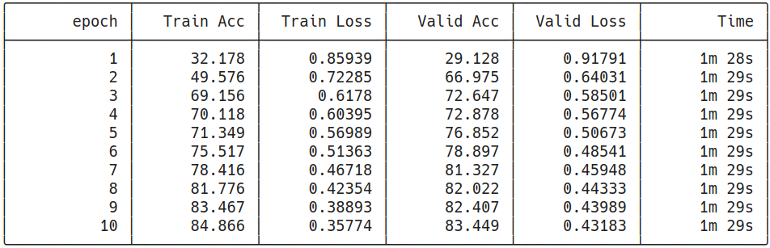
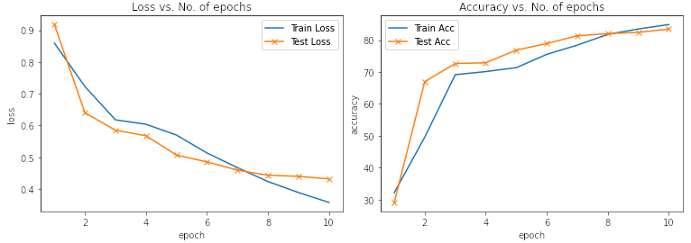
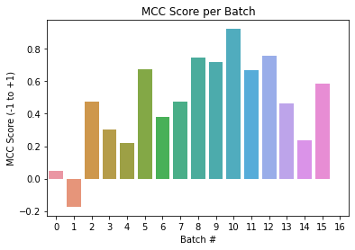

# E2A14P2

**Note: only code changes/major additional codes are shown. For complete code, please see the accompanying notebooks**

## Objectives
The objectives of this assignment was to train the BERT Model for Sequence Classification on the Corpus of Linguistic Acceptability (CoLA) dataset.

### Link to Notebook

[](https://colab.research.google.com/github/payne101/E_14_2/blob/main/E_14_2.ipynb)


## Notebook Features
- The training is done using PyTorch Lightning

## Obtaining Data and Tokenization
The data is downloaded from a [public url](https://nyu-mll.github.io/CoLA/cola_public_1.1.zip) and extracted. It is read into a Pandas dataframe. Although a tokenized version of the data is available, we avoid using it and use the tokenizer from the transformers library.

This is followed by the creation of Dataset and Dataloader.

## Model

We use the `AutoModelForSequenceClassification` model from the transformers library and pass in the necessary parameters.

```python
automodel = AutoModelForSequenceClassification.from_pretrained(
    model_checkpoint, 
    num_labels = 2, 
    output_attentions = False, 
    output_hidden_states = False,
)
```
## Calculating Loss
If the labels are provided to the model, it automatically computes the loss values and we don't have to specify/calculate the loss function etc.


## Training Log


## Plots of Logs


## Plots of MCC Score


### MCC Score
The evaluation yielded an MCC score of 0.498
